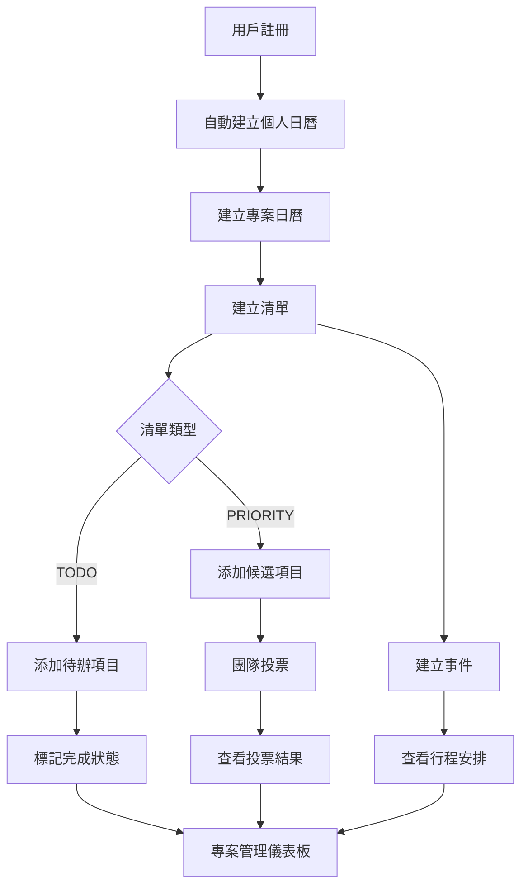

# REST API 規格文檔

DateTree REST API 提供完整的清單和事件管理功能。

## 🚀 API 概覽

* **基礎 URL**: `http://localhost:8000/api/v1`
* **認證方式**: Bearer Token (計劃中)
* **資料格式**: JSON
* **API 版本**: v1

## 📋 API 端點

### Users (用戶管理)

#### 用戶註冊

```http
POST /api/v1/users/register
```

**描述**: 註冊新用戶。此操作會自動為新用戶建立一個預設的個人日曆。

**請求主體**：

```json
{
  "email": "user@example.com",
  "password": "securepassword123"
}
```

**成功回應** (200 OK)：

```json
{
  "id": 1,
  "email": "user@example.com",
  "is_active": true
}
```

### Calendars (日曆管理)

#### 取得所有日曆

```http
GET /api/v1/calendars/
```

**描述**: 取得認證用戶擁有的所有日曆。

#### 建立新日曆

```http
POST /api/v1/calendars/
```

**描述**: 建立一個新的 `GENERAL` 類型日曆。

**請求主體**：

```json
{
  "name": "新的日曆",
  "description": "這是一個測試日曆"
}
```

#### 刪除日曆

```http
DELETE /api/v1/calendars/{calendar_id}
```

**描述**: 刪除一個日曆。注意：`PERSONAL` 類型的日曆無法被刪除。

### Lists (清單管理)

#### 取得所有清單

```http
GET /api/v1/lists/
```

**回應範例**：

```json
[
  {
    "id": 1,
    "name": "我的待辦清單",
    "list_type": "TODO",
    "calendar_id": 1,
    "created_at": "2025-06-29T10:00:00Z"
  },
  {
    "id": 2,
    "name": "旅遊地點投票",
    "list_type": "PRIORITY",
    "calendar_id": 1,
    "created_at": "2025-06-29T11:00:00Z"
  }
]
```

#### 取得特定清單

```http
GET /api/v1/lists/{list_id}
```

**路徑參數**：
* `list_id` (integer) - 清單 ID

**回應範例**：

```json
{
  "id": 1,
  "name": "我的待辦清單",
  "list_type": "TODO",
  "calendar_id": 1,
  "created_at": "2025-06-29T10:00:00Z"
}
```

#### 取得日曆的清單

```http
GET /api/v1/lists/calendar/{calendar_id}
```

**路徑參數**：
* `calendar_id` (integer) - 日曆 ID

#### 建立新清單

```http
POST /api/v1/lists/
```

**請求主體**：

```json
{
  "name": "新的清單",
  "list_type": "TODO",
  "calendar_id": 1
}
```

**回應**：

```json
{
  "id": 3,
  "name": "新的清單",
  "list_type": "TODO",
  "calendar_id": 1,
  "created_at": "2025-06-29T12:00:00Z"
}
```

#### 更新清單

```http
PUT /api/v1/lists/{list_id}
```

**路徑參數**：
* `list_id` (integer) - 清單 ID

**請求主體**：

```json
{
  "name": "更新後的清單名稱",
  "list_type": "PRIORITY"
}
```

#### 刪除清單

```http
DELETE /api/v1/lists/{list_id}
```

**回應**：`204 No Content`

### List Items (清單項目管理)

#### 取得清單的所有項目

```http
GET /api/v1/list-items/list/{list_id}
```

**回應範例**：

```json
[
  {
    "id": 1,
    "content": "買牛奶",
    "is_completed": false,
    "list_id": 1,
    "creator_id": 1,
    "created_at": "2025-07-01T10:00:00Z"
  }
]
```

#### 取得帶投票數的清單項目

```http
GET /api/v1/list-items/list/{list_id}/with-votes
```

**回應範例**：

```json
[
  {
    "id": 1,
    "content": "陽明山登山",
    "is_completed": false,
    "list_id": 1,
    "creator_id": 1,
    "created_at": "2025-07-01T10:00:00Z",
    "vote_count": 3
  }
]
```

#### 建立清單項目

```http
POST /api/v1/list-items/
```

**請求主體**：

```json
{
  "content": "完成專案文檔",
  "list_id": 1
}
```

#### 更新清單項目

```http
PUT /api/v1/list-items/{item_id}
```

**請求主體**：

```json
{
  "content": "更新的項目內容",
  "is_completed": true
}
```

#### 刪除清單項目

```http
DELETE /api/v1/list-items/{item_id}
```

### Votes (投票管理)

#### 對項目投票

```http
POST /api/v1/votes/
```

**請求主體**：

```json
{
  "list_item_id": 1
}
```

#### 取得項目的所有投票

```http
GET /api/v1/votes/item/{item_id}
```

#### 取得我的投票記錄

```http
GET /api/v1/votes/user/my-votes
```

#### 取消投票

```http
DELETE /api/v1/votes/item/{item_id}
```

### Events (事件管理)

#### 取得日曆的所有事件

```http
GET /api/v1/events/calendar/{calendar_id}
```

**回應範例**：

```json
[
  {
    "id": 1,
    "title": "團隊會議",
    "description": "週例會",
    "start_time": "2025-07-01T10:00:00Z",
    "end_time": "2025-07-01T11:00:00Z",
    "calendar_id": 1,
    "creator_id": 1
  }
]
```

#### 取得即將到來的事件

```http
GET /api/v1/events/calendar/{calendar_id}/upcoming
```

#### 按日期範圍查詢事件

```http
GET /api/v1/events/calendar/{calendar_id}/date-range?start_date=2025-07-01T00:00:00Z&end_date=2025-07-07T23:59:59Z
```

#### 建立事件

```http
POST /api/v1/events/
```

**請求主體**：

```json
{
  "title": "牙醫預約",
  "description": "定期檢查",
  "start_time": "2025-07-02T14:00:00Z",
  "end_time": "2025-07-02T15:00:00Z",
  "calendar_id": 1
}
```

#### 更新事件

```http
PUT /api/v1/events/{event_id}
```

#### 刪除事件

```http
DELETE /api/v1/events/{event_id}
```

### 清單類型

目前支援的清單類型：

* `TODO` - 一般待辦清單
* `PRIORITY` - 優先級投票清單

## 🔒 認證與授權

### 認證方式 (計劃中)

API 將使用 JWT Bearer Token 進行認證：

```http
Authorization: Bearer <your-jwt-token>
```

### 權限控制

* 使用者只能存取自己有權限的日曆
* 清單的建立、修改、刪除需要對應的日曆權限

## 📊 狀態碼

### 成功回應

* `200 OK` - 成功取得資料
* `201 Created` - 成功建立資源
* `204 No Content` - 成功刪除資源

### 錯誤回應

* `400 Bad Request` - 請求格式錯誤
* `401 Unauthorized` - 認證失敗
* `403 Forbidden` - 權限不足
* `404 Not Found` - 資源不存在
* `422 Unprocessable Entity` - 資料驗證失敗
* `500 Internal Server Error` - 伺服器內部錯誤

### 錯誤格式

```json
{
  "detail": "錯誤描述",
  "error_code": "VALIDATION_ERROR",
  "field_errors": {
    "name": ["此欄位為必填項目"]
  }
}
```

## 🔄 分頁

大量資料的端點支援分頁：

```http
GET /api/v1/lists/?page=1&size=20
```

**查詢參數**：
* `page` (integer) - 頁碼，預設為 1
* `size` (integer) - 每頁筆數，預設為 20，最大 100

**分頁回應格式**：

```json
{
  "items": [...],
  "total": 100,
  "page": 1,
  "size": 20,
  "pages": 5
}
```

## 🔍 過濾與搜尋

### 過濾

```http
GET /api/v1/lists/?list_type=TODO&calendar_id=1
```

### 搜尋

```http
GET /api/v1/lists/?search=待辦
```

### 排序

```http
GET /api/v1/lists/?sort=created_at&order=desc
```

## 📱 API 使用範例

### JavaScript (Fetch API)

```javascript
// 建立新清單
async function createList(listData) {
  try {
    const response = await fetch('/api/v1/lists/', {
      method: 'POST',
      headers: {
        'Content-Type': 'application/json',
        'Authorization': `Bearer ${token}`
      },
      body: JSON.stringify(listData)
    });
    
    if (!response.ok) {
      throw new Error(`HTTP error! status: ${response.status}`);
    }
    
    const newList = await response.json();
    return newList;
  } catch (error) {
    console.error('建立清單失敗:', error);
    throw error;
  }
}

// 取得清單
async function getLists() {
  try {
    const response = await fetch('/api/v1/lists/', {
      headers: {
        'Authorization': `Bearer ${token}`
      }
    });
    
    const lists = await response.json();
    return lists;
  } catch (error) {
    console.error('取得清單失敗:', error);
    throw error;
  }
}
```

### Python (requests)

```python
import requests

API_BASE_URL = "http://localhost:8000/api/v1"
TOKEN = "your-jwt-token"

def create_list(list_data):
    """建立新清單"""
    headers = {
        "Authorization": f"Bearer {TOKEN}",
        "Content-Type": "application/json"
    }
    
    response = requests.post(
        f"{API_BASE_URL}/lists/",
        json=list_data,
        headers=headers
    )
    
    response.raise_for_status()
    return response.json()

def get_lists():
    """取得所有清單"""
    headers = {"Authorization": f"Bearer {TOKEN}"}
    
    response = requests.get(
        f"{API_BASE_URL}/lists/",
        headers=headers
    )
    
    response.raise_for_status()
    return response.json()

# 使用範例
if __name__ == "__main__":
    # 建立清單
    new_list = create_list({
        "name": "我的待辦清單",
        "list_type": "TODO",
        "calendar_id": 1
    })
    print(f"建立清單: {new_list}")
    
    # 取得清單
    lists = get_lists()
    print(f"清單數量: {len(lists)}")
```

### cURL

```bash
# 建立清單
curl -X POST "http://localhost:8000/api/v1/lists/" \
  -H "Content-Type: application/json" \
  -H "Authorization: Bearer $TOKEN" \
  -d '{
    "name": "我的待辦清單",
    "list_type": "TODO",
    "calendar_id": 1
  }'

# 取得清單
curl -X GET "http://localhost:8000/api/v1/lists/" \
  -H "Authorization: Bearer $TOKEN"

# 更新清單
curl -X PUT "http://localhost:8000/api/v1/lists/1" \
  -H "Content-Type: application/json" \
  -H "Authorization: Bearer $TOKEN" \
  -d '{
    "name": "更新後的清單名稱"
  }'

# 刪除清單
curl -X DELETE "http://localhost:8000/api/v1/lists/1" \
  -H "Authorization: Bearer $TOKEN"
```

## 🧪 測試 API

### 使用 Swagger UI

1. 啟動開發伺服器：
   ```bash
   cd backend
   uv run uvicorn app.main:app --reload
   ```

2. 開啟 Swagger UI：<http://localhost:8000/docs>

3. 在 Swagger UI 中測試各個端點

### 使用 Thunder Client (VS Code)

1. 安裝 Thunder Client 擴展
2. 建立新的 Collection
3. 添加各個 API 端點
4. 設定認證 Header

### 使用 Postman

1. 匯入 OpenAPI 規格：<http://localhost:8000/openapi.json>
2. 設定環境變數（base_url, token）
3. 測試各個端點

## 🔗 API 關聯關係與使用流程

### 資料模型關聯

DateTree 的 API 遵循階層式資料結構：

```
用戶 (User)
└── 日曆 (Calendar) 1:N
    ├── 清單 (List) 1:N
    │   └── 清單項目 (ListItem) 1:N
    │       └── 投票 (Vote) 1:N
    └── 事件 (Event) 1:N
```

### 核心關聯規則

1. **用戶 → 日曆**: 每個用戶註冊時自動建立一個個人日曆 (PERSONAL)，可額外建立多個一般日曆 (GENERAL)
2. **日曆 → 清單**: 每個日曆可包含多個不同類型的清單 (TODO/PRIORITY)
3. **日曆 → 事件**: 每個日曆可包含多個事件，用於行程管理
4. **清單 → 清單項目**: 每個清單可包含多個任務項目
5. **清單項目 → 投票**: PRIORITY 類型清單的項目可被用戶投票，用於協作決策

### 💡 典型使用流程範例

#### 場景：團隊旅遊規劃

假設有一個團隊要規劃旅遊，需要收集旅遊地點建議並投票決定：

##### 1. 用戶註冊與初始設置

```http
# 1.1 團隊成員註冊帳號
POST /api/v1/users/register
{
  "email": "alice@example.com",
  "password": "password123"
}
# 回應: 用戶資料 + 自動建立個人日曆

# 1.2 登入取得認證 token
POST /api/v1/auth/login
{
  "email": "alice@example.com", 
  "password": "password123"
}
# 回應: JWT token

# 1.3 建立共享的旅遊規劃日曆
POST /api/v1/calendars/
Authorization: Bearer <token>
{
  "name": "2025 團隊旅遊規劃",
  "description": "春季旅遊活動規劃"
}
# 回應: calendar_id = 2
```

##### 2. 建立投票清單收集地點建議

```http
# 2.1 建立旅遊地點投票清單
POST /api/v1/lists/
Authorization: Bearer <token>
{
  "name": "旅遊地點候選",
  "list_type": "PRIORITY",
  "calendar_id": 2
}
# 回應: list_id = 1

# 2.2 建立待辦事項清單
POST /api/v1/lists/
Authorization: Bearer <token>
{
  "name": "旅遊準備事項",
  "list_type": "TODO", 
  "calendar_id": 2
}
# 回應: list_id = 2
```

##### 3. 團隊成員添加旅遊地點建議

```http
# 3.1 Alice 建議陽明山
POST /api/v1/list-items/
Authorization: Bearer <alice_token>
{
  "content": "陽明山國家公園 - 賞花健行",
  "list_id": 1
}
# 回應: item_id = 1

# 3.2 Bob 建議九份
POST /api/v1/list-items/
Authorization: Bearer <bob_token>
{
  "content": "九份老街 - 古色古香",
  "list_id": 1  
}
# 回應: item_id = 2

# 3.3 Carol 建議淡水
POST /api/v1/list-items/
Authorization: Bearer <carol_token>
{
  "content": "淡水漁人碼頭 - 夕陽美景",
  "list_id": 1
}
# 回應: item_id = 3
```

##### 4. 團隊投票決定地點

```http
# 4.1 Alice 投票給九份 (她覺得很有特色)
POST /api/v1/votes/
Authorization: Bearer <alice_token>
{
  "list_item_id": 2
}

# 4.2 Bob 投票給自己的建議九份
POST /api/v1/votes/
Authorization: Bearer <bob_token>
{
  "list_item_id": 2  
}

# 4.3 Carol 投票給淡水
POST /api/v1/votes/
Authorization: Bearer <carol_token>
{
  "list_item_id": 3
}

# 4.4 Dave 也投票給九份
POST /api/v1/votes/
Authorization: Bearer <dave_token>
{
  "list_item_id": 2
}
```

##### 5. 查看投票結果

```http
# 5.1 查看帶投票數的清單項目
GET /api/v1/list-items/list/1/with-votes
Authorization: Bearer <token>

# 回應:
[
  {
    "id": 1,
    "content": "陽明山國家公園 - 賞花健行",
    "vote_count": 0,
    "list_id": 1,
    "creator_id": 1
  },
  {
    "id": 2, 
    "content": "九份老街 - 古色古香",
    "vote_count": 3,
    "list_id": 1,
    "creator_id": 2
  },
  {
    "id": 3,
    "content": "淡水漁人碼頭 - 夕陽美景", 
    "vote_count": 1,
    "list_id": 1,
    "creator_id": 3
  }
]
# 結果: 九份獲得最高票數 (3票)
```

##### 6. 規劃旅遊行程事件

```http
# 6.1 確定目的地後，建立旅遊事件
POST /api/v1/events/
Authorization: Bearer <token>
{
  "title": "九份一日遊",
  "description": "團隊旅遊 - 九份老街探索",
  "start_time": "2025-04-15T09:00:00Z",
  "end_time": "2025-04-15T18:00:00Z", 
  "calendar_id": 2
}
# 回應: event_id = 1

# 6.2 建立集合時間事件
POST /api/v1/events/
Authorization: Bearer <token>
{
  "title": "旅遊集合",
  "description": "台北車站東三門集合",
  "start_time": "2025-04-15T08:30:00Z",
  "end_time": "2025-04-15T09:00:00Z",
  "calendar_id": 2  
}
# 回應: event_id = 2
```

##### 7. 建立準備事項

```http
# 7.1 添加待辦事項
POST /api/v1/list-items/
Authorization: Bearer <token>
{
  "content": "預訂交通票券",
  "list_id": 2
}

POST /api/v1/list-items/
Authorization: Bearer <token>
{
  "content": "準備雨具", 
  "list_id": 2
}

POST /api/v1/list-items/
Authorization: Bearer <token>
{
  "content": "確認餐廳訂位",
  "list_id": 2
}
```

##### 8. 查看完整規劃

```http
# 8.1 查看日曆的所有清單
GET /api/v1/lists/calendar/2
Authorization: Bearer <token>

# 8.2 查看即將到來的事件
GET /api/v1/events/calendar/2/upcoming
Authorization: Bearer <token>

# 8.3 查看準備事項進度
GET /api/v1/list-items/list/2  
Authorization: Bearer <token>
```

### 🔄 API 調用流程圖



### 📋 常見操作模式

#### 個人任務管理模式
1. 使用個人日曆 (PERSONAL) 
2. 建立 TODO 類型清單
3. 添加待辦項目
4. 標記完成狀態
5. 建立提醒事件

#### 團隊協作投票模式  
1. 建立共享日曆 (GENERAL)
2. 建立 PRIORITY 類型清單
3. 團隊成員添加候選項目
4. 進行投票決策
5. 根據結果建立行動計畫

#### 專案管理模式
1. 每個專案一個日曆
2. 混合使用 TODO 和 PRIORITY 清單
3. 重要事件設定提醒
4. 定期檢視進度和時程

### ⚠️ 重要約束

1. **權限控制**: 用戶只能操作自己有權限的日曆及其內容
2. **資料一致性**: 刪除上層資源會級聯刪除下層資源
3. **投票限制**: 每個用戶對同一項目只能投票一次
4. **日曆類型**: PERSONAL 日曆不可刪除，每個用戶只有一個

## 📚 相關文檔

* [OpenAPI 規格](http://localhost:8000/openapi.json)
* [Swagger UI](http://localhost:8000/docs)
* [ReDoc](http://localhost:8000/redoc)
* [API 使用範例](examples.md)
* [認證指南](../guides/authentication.md) (計劃中)
