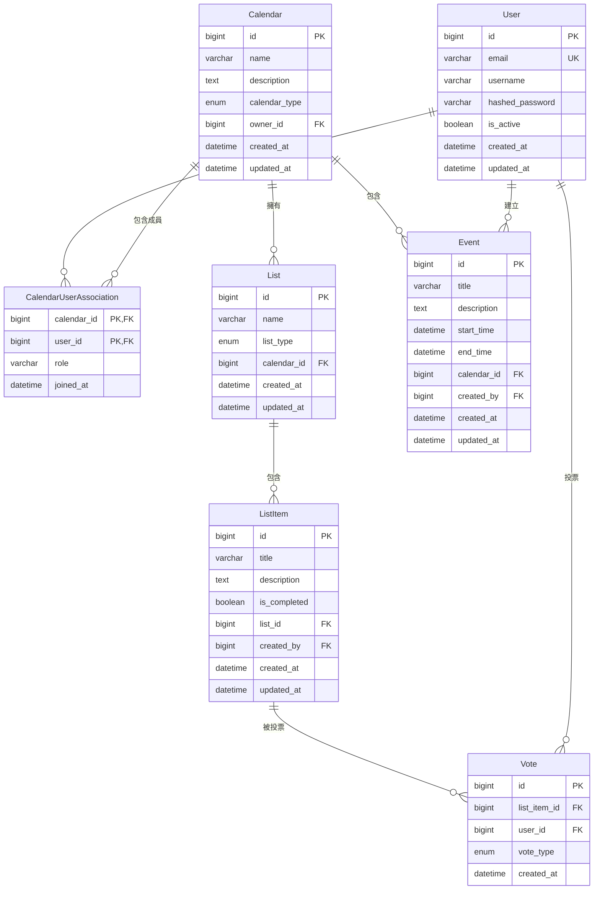
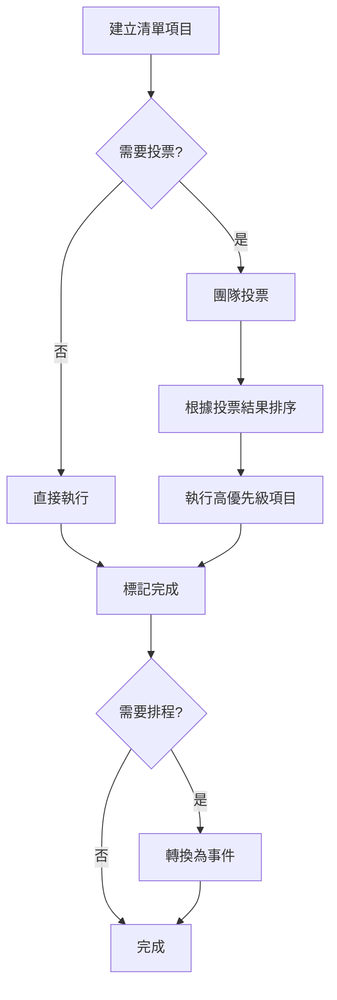
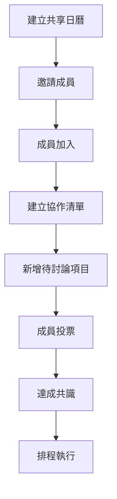

# DateTree 資料模型架構

## 📊 架構概覽

DateTree 採用擴展式多清單模型，支援靈活的協作和待辦事項管理。

## 🏗️ 核心實體關係

## 📋 實體詳細說明

### User (使用者)

**職責**: 系統的核心使用者實體

**重要欄位**:
- `email`: 唯一的使用者識別碼
- `is_active`: 帳號狀態控制
- `hashed_password`: 安全的密碼儲存

**關聯**:
- 可以參與多個日曆 (多對多)
- 可以建立事件和清單項目
- 可以對清單項目投票

### Calendar (日曆)

**職責**: 協作的容器，包含清單和事件

**核心概念**:
- 每個使用者都有一個預設的個人日曆
- 支援多人共享的協作日曆
- 日曆擁有者可以邀請其他使用者

**關聯**:
- 包含多個清單和事件
- 透過關聯表管理成員關係

### List (清單)

**職責**: 組織待辦事項和協作內容的容器

**清單類型** (`ListType` 枚舉):
- `TODO`: 一般待辦清單
- `PRIORITY`: 優先級投票清單
- 未來可擴展更多類型

**特色**:
- 屬於特定日曆
- 支援不同的業務邏輯（如投票）

### ListItem (清單項目)

**職責**: 具體的待辦事項或協作項目

**生命週期**:
1. 建立項目
2. (可選) 接受投票
3. 標記完成
4. (可能) 轉換為事件

**狀態追蹤**:
- `is_completed`: 完成狀態
- `created_by`: 建立者追蹤

### Vote (投票)

**職責**: 支援協作決策的投票機制

**投票類型** (`VoteType` 枚舉):
- `UP`: 支持票
- `DOWN`: 反對票
- 未來可擴展評分等機制

**應用場景**:
- 優先級決策
- 選項篩選
- 團隊共識

### Event (事件)

**職責**: 已排程的確定事件

**與清單項目的關係**:
- 事件可以從清單項目轉換而來
- 事件有明確的時間安排
- 事件在日曆視圖中顯示

## 🔄 業務流程

### 1. 待辦事項管理流程

### 2. 協作流程

## ⚙️ 技術特色

### 1. 可擴展性
- **枚舉擴展**: 清單類型和投票類型可輕鬆新增
- **模組化設計**: 每個模型都有獨立的檔案
- **關聯彈性**: 支援複雜的多對多關係

### 2. 資料完整性
- **外鍵約束**: 確保關聯資料的一致性
- **唯一約束**: 防止重複資料
- **時間戳記**: 完整的建立和更新時間追蹤

### 3. 效能考量
- **索引最佳化**: 在查詢頻繁的欄位上建立索引
- **關聯預載**: 支援 SQLAlchemy 的關聯預載
- **分頁支援**: 大量資料的分頁查詢

## 🔮 未來擴展計劃

### 短期
- **標籤系統**: 為清單項目新增標籤支援
- **到期日**: 清單項目和事件的到期提醒
- **優先級**: 數值化的優先級系統

### 中期
- **檔案附件**: 支援檔案上傳和關聯
- **評論系統**: 項目討論和協作留言
- **模板系統**: 常用清單和事件模板

### 長期
- **工作流程**: 自動化的項目流程
- **報表分析**: 團隊效率和完成率分析
- **外部整合**: 與其他工具的 API 整合

## 📚 相關文檔

- [ADR-002: 採用擴展式多清單模型](../adr/002-adopt-extendable-multi-list-model.md)
- [資料庫遷移指南](../guides/database-management.md)
- [List CRUD API 實施](../implementation/list-crud-api.md)
